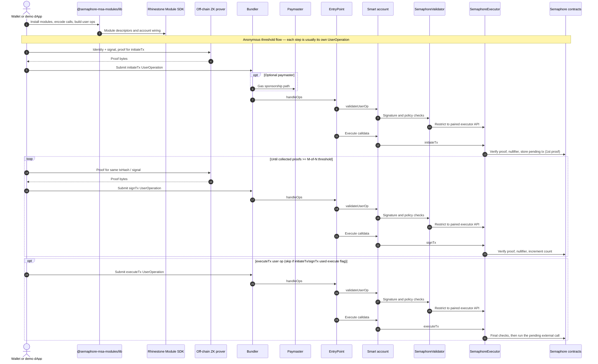

# Semaphore Modular Smart Account Modules

**ERC-7579 modules** that plug Semaphore’s anonymous group proofs into **ERC-4337** modular smart accounts—so members can co-author transactions without revealing *which* member approved each action on-chain.

## Try it

- [Demo website](https://semaphore-msa-modules.jimmychu0807.hk/) (connect on **Base Sepolia**)
- [Demo video](https://www.loom.com/share/0b800171a4f1491f9eedd4f555569e37?sid=0c2d3024-5652-499e-b374-218023da581b)
- [Project write-up](https://jimmychu0807.hk/semaphore-msa-modules)

## What this repo delivers

Two complementary [ERC-7579](https://eips.ethereum.org/EIPS/eip-7579) modules (see [validators and executors](https://eips.ethereum.org/EIPS/eip-7579#validators)) backed by [Semaphore](https://semaphore.pse.dev/):

| Module | Role |
|--------|------|
| **SemaphoreValidator** | Validates `UserOperation` signatures (EdDSA + identity commitment in the account’s Semaphore [group](https://docs.semaphore.pse.dev/guides/groups)). Restricts calls so the account can only drive the paired executor’s API surface. |
| **SemaphoreExecutor** | Holds per-account state (group, threshold, pending txs, collected proofs). Exposes **`initiateTx` → `signTx` → `executeTx`** so proofs act like threshold “signatures” while preserving member privacy. |

Together they give a smart account **anonymous threshold control**: only group members can advance state, proofs are unique per signal (no replay as the same “vote”), and calldata does not deanonymize the prover.

**Project code:** FY24-1847 · Development supported by the [PSE Acceleration Program](https://github.com/privacy-scaling-explorations/acceleration-program) ([discussion](https://github.com/privacy-scaling-explorations/acceleration-program/issues/72)).

## Architecture

High-level data flow from a developer-built client through account abstraction to Semaphore on-chain.



**How to read it:** clients use the library (with **Rhinestone Module SDK** and **viem** under the hood) to install modules, encode calls, and assemble user ops; an off-chain prover produces Semaphore proofs; a **bundler** submits each `UserOperation` to **EntryPoint** (with an optional **paymaster**); the **validator** checks the user-op path and signature; the **executor** runs **`initiateTx`** (first proof, pending tx), then **`signTx`** in a loop until the account’s **M-of-N threshold** is met, then **`executeTx`** when proofs are sufficient (or earlier if `execute` is set so the contract auto-runs `executeTx` once the threshold is reached).

## Who should integrate this?

Pick this stack when you are **not** satisfied with a plain on-chain multisig that reveals approvers, but you still want **account abstraction** (gas sponsorship, batched ops, smart accounts) and **modular** validation per [ERC-7579](https://eips.ethereum.org/EIPS/eip-7579).

| If you are building… | Why integrate |
|----------------------|----------------|
| **Modular smart account products** (wallets, DAO tooling, team treasuries) | Add a **privacy-preserving threshold** policy: M-of-N control without exposing which key approved each transaction. |
| **dApps that already use Semaphore** | Reuse **groups and proofs** as the authorization layer for a **4337** smart account instead of only for app-specific claims. |
| **Rhinestone / Module SDK workflows** | The published package exposes **`getSemaphoreExecutor`** and **`getSemaphoreValidator`** module descriptors compatible with **`@rhinestone/module-sdk`**, so you can treat these modules like other installable validators and executors. |
| **Research and education** | End-to-end reference: Foundry tests (FFI + proofs), a **Next.js** demo, and Dockerized **Alto** + paymaster for local experimentation. |

You will touch **Solidity** if you fork or redeploy the modules, **TypeScript** for proofs and user-ops (`viem`, Semaphore protocol packages), and **4337 infrastructure** (bundler RPC, optional paymaster) for production UX.

## Monorepo layout

| Package | Description |
|---------|-------------|
| [`packages/contracts`](./packages/contracts) | **Foundry** contracts: `SemaphoreValidator`, `SemaphoreExecutor`, tests, deployment scripts. Includes **Base Sepolia** deployment addresses in its README. |
| [`packages/lib`](./packages/lib) | **`@semaphore-msa-modules/lib`**: module installation helpers, ABIs, and transaction helpers built on **viem** and **Rhinestone Module SDK**. |
| [`packages/web`](./packages/web) | **Next.js** demo UI for installing modules, managing identities, and sending demo transactions. |
| [`docker-containers`](./docker-containers) | **Docker Compose**: forked **Anvil**, **Alto** bundler, mock paymaster—used by `pnpm dev` at the workspace root. |

**Requirements:** Node **≥ 22**, **pnpm** (see root `package.json` for the pinned version).

**Common commands:**

```bash
pnpm install
pnpm dev          # Docker stack + package dev servers
pnpm ci-check     # build, test, lint across packages
```

## Standards and further reading


*Source: [ERC-4337 documentation](https://www.erc4337.io/docs/understanding-ERC-4337/architecture)*

- [ERC-4337](https://eips.ethereum.org/EIPS/eip-4337) — [overview](https://www.erc4337.io/)
- [ERC-7579](https://eips.ethereum.org/EIPS/eip-7579) — [overview](https://erc7579.com/)
- [ERC-7780](https://eips.ethereum.org/EIPS/eip-7780) (stateless validator hooks used by the validator module—see contracts README)

## Acknowledgements

Thanks to everyone who shaped and supported this work:

- [Saleel P](https://github.com/saleel) for the original impetus with [Semaphore Wallet](https://github.com/saleel/semaphore-wallet) and showing the approach was viable.
- [Cedoor](https://github.com/cedoor) and [Vivian Plasencia](https://github.com/vplasencia) for Semaphore guidance.
- [John Guilding](https://github.com/JohnGuilding) for discussion, support, and review.
- The [Rhinestone](https://rhinestone.wtf/) team and [Konrad Kopp](https://github.com/kopy-kat) for [ModuleKit](https://docs.rhinestone.wtf/build-modules), [Module SDK](https://docs.rhinestone.wtf/build-modules), and ERC-7579 foundations this repo builds on.
